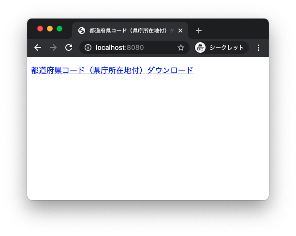

# OpenResty レスポンス書き換えサンプル

[OpenResty](https://openresty.org/) とは [Nginx](https://nginx.org/) を [Lua](https://www.lua.org/) および [LuaJIT](https://luajit.org/) で拡張することを可能としたパッケージである。
OpenResty を使用すると HTTP/HTTPS のリクエストやレスポンスの一部や全部を書き換えたり、認証を追加したり、外部サイトの結果を取得したりと様々なことが Lua を介して実現できる。

このプロジェクトは [Node.js](https://nodejs.org/) と [Express](https://expressjs.com/) を用いて作成したシンプルな CSV をダウンロードするウェブアプリケーションに対して、OpenResty でリバースプロキシを介してアクセスすることで HTML とダウンロードされる CSV のレスポンスを書き換えるサンプルである。


ウェブアプリに直接アクセスした場合と Nginx 経由でレスポンスを書き換えた場合の見た目は以下の違いがある（タイトルとリンクテキストを書き換え）。

|ウェブアプリ直接|Nginx 経由|
|:--------------:|:--------:|
||

ダウンロードする CSV ファイルも以下の違いがある（各都道府県に県庁所在地を追加）。

**ウェブアプリ直接**

```csv
コード,都道府県
01,北海道
02,青森県
03,岩手県
04,宮城県
...
```

**Nginx 経由**

```csv
コード,都道府県,県庁所在地
01,北海道,札幌市
02,青森県,青森市
03,岩手県,盛岡市
04,宮城県,仙台市
...
```

このサンプルは以下のように試すことができる。

## Docker コンテナの作成

以下の手順でコンテナを作成する。

```shell-session
$ # イメージ作成
$ docker build -t debian/openresty-sample:latest .
...
$ # コンテナ作成＆バックグラウンド実行
$ docker run -v `pwd`:/root --name openresty-sample -p 8080:8080 -p 3000:3000 -it -d debian/openresty-sample:latest /bin/bash
...
$
```

## 検証手順

以下の手順でホスト側のターミナルでコンテナにログインし、Nginx とウェブアプリを実行する。

```shell-session
$ docker exec -it openresty-sample /bin/bash
...
# /usr/local/openresty/nginx/sbin/nginx -p /root/nginx -c nginx.conf && (cd && npm install && node .)
```

ブラウザでそれぞれ以下を開き、CSV をダウンロードする。

- ウェブアプリ直接: <http://localhost:3000>
- Nginx 経由: <http://localhost:8080>

## Docker コンテナおよびイメージの削除

検証が終わったら以下の手順でコンテナとイメージを削除する。

```shell-session
$ # コンテナ終了
$ docker stop openresty-sample
...
$ # コンテナ削除
$ docker rm openresty-sample
...
$ # イメージ削除
$ docker rmi debian/openresty-sample
...
$
```
